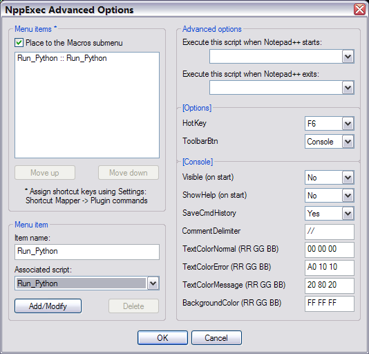

效果图如下,在Notepad++编辑器下运行快捷键,Python会运行当前脚本,Notepad++的控制台会显示相关运行信息。


## 安装插件

打开notepad++,选择Plugins -> Plugin Manager –> Show Plugin Manager


选择 Available -> NppExec ->Install


单击Yes自动重启Notepad++


-------------------------

## 配置NppExec

打开Plugins -> NppExec -> Execute 或者直接按下F6


在弹出的Execute…窗口中粘贴：
```
NPP_SAVE
CD $(CURRENT_DIRECTORY)
< PYTHON_HOME >  "$(FULL_CURRENT_PATH)" 
```

- <PYTHON_HOME> :表示安装在你本机的python的路径,，一定要带python.exe;
- 如果给python添加了环境变量的,可以直接使用python即可,像截图上一样。
使用<PYTHON_HOM>的方便在于,如果你安装了好几个版本的python,那么可以通过不同的路径来编译不同版本的脚本。

单击Save… 且在Script name窗口中添加命令的名字(名字可以随意取)-> Save -> Ok


## 设置快捷键

选择Plugins -> NppExec -> Advanced Options…


先勾选Place to the Macros submenu,然后在Associated script的下拉列表中选择自己已经定 义的命令名称,单击Add/Modify,这时自己定义的命令已经添加到了上边的框中。


单击OK -> OK,然后手动重启 Notepad++
选择Settings -> Shortcut Mapper 


打开Plugin commands标签,找到自己定义的命令,选择Modify,或者直接双击


在弹出的Shortcut窗口上选择自己喜欢的快捷键去触发这个命令(不要重复了),单击OK –> Close。

